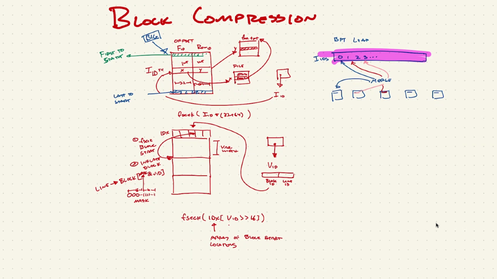

# Final Report
## CSCI 5900- Independent Study
## Sagar Pathare
## Date: April 26, 2022

## Title: Using compression algorithms in GIGGLE to reduce disk space usage

# 1.  Compression of the B+ tree leaves
# 2.  Compression of the offset index 

After compressing the files for leaves, currently, the file that takes up the most space is the offset index file- `offset_index.dat`. It stores a list of a pair of integers `x` and `y` where `x` is the file ID and `y` is the line ID in that file. We need the ability to read a particular position in the compressed file. After exploring various ways to implement compression, we concluded that we should implement block impression. 

## Structure of the `offset_index.dat` file
* 0-63 (8B) : `num`- the number of `file_id_offset_pairs` stored in the file
* 64-95 (4B) : `width`- the width of each `file_id_offset_pair`, currently 96 bits (12B)
  * Each `file_id_offset_pair` stores the two integers mentioned above
    * 32 bit `file_id` (`x`)
    * 64 bit `offset` (`y`)
* 96-... : `file_id_offset_pairs`

## Block Compression Implementation

In the following diagram, Ryan has explained well how block compression could be implemented for `offset_index.dat`.

Block Compression- Ryan Layer

1. We will store a fixed number of pairs of integers as one block and then apply the compression on each block. What a good block size could be needs to be determined experimentally.
2. Currently, the leaf node stores `I_10`- which is the `offset_id` in the `offset_index.dat` file. Instead of storing `I_10`, we will store two values- the compressed block offset ID and the line offset ID within that block.
3. We will also store the compressed offsets for each compressed block.
4. To retrieve the original uncompressed `I_10`/`offset_id`, we will seek compressed file to the compressed block offset ID. We will uncompress the whole block and then seek to the line offset ID.

## Proposed structure of the `offset_index_compressed.dat` file
* 0-63 (8B) : `num`- the number of `file_id_offset_pairs` stored in the file
* 64-95 (4B) : `width`- the width of each `file_id_offset_pair`, currently 96 bits (12B)
* 96-127 (4B) : `block_size`- the size of each uncompressed block- same for all blocks
* 128-... : `compressed_offsets`- the offset of each compressed block
* ...-... : `compressed_data`- the actual compressed blocks
## Proposed Block Compression Implementation
We will create a standalone program called `block_compression.c` with the following functionality-
1. Compress `offset_index.dat` to `offset_index_compressed.dat`
2. Uncompress `offset_index_compressed.dat` to `offset_index.dat`
3. Read `offset_id` from `offset_index.dat`
4. Read `offset_id` from `offset_index_compressed.dat`

We need to write unit tests to make sure the output from 3 and 4 are the same.
## To be explained later
* `mmap` usage
* `offset_data_append_data` function pointer usage instead of `fwrite`
* `OFFSET_INDEX_DATA` macro definition

## Blocker (To do for Ryan)
* Figure out how to store two values in the leaf store  
# 3. Other fixes made in the repository
* Added data files and executable files in the unit tests to gitignore.
* Fixed the unit tests Makefile issue that prevented two consecutive builds without running make clean- the _Runner.c files were also being considered for tests. Added wildcard filter to ignore them.
* Fixed minor bugs and formatting.